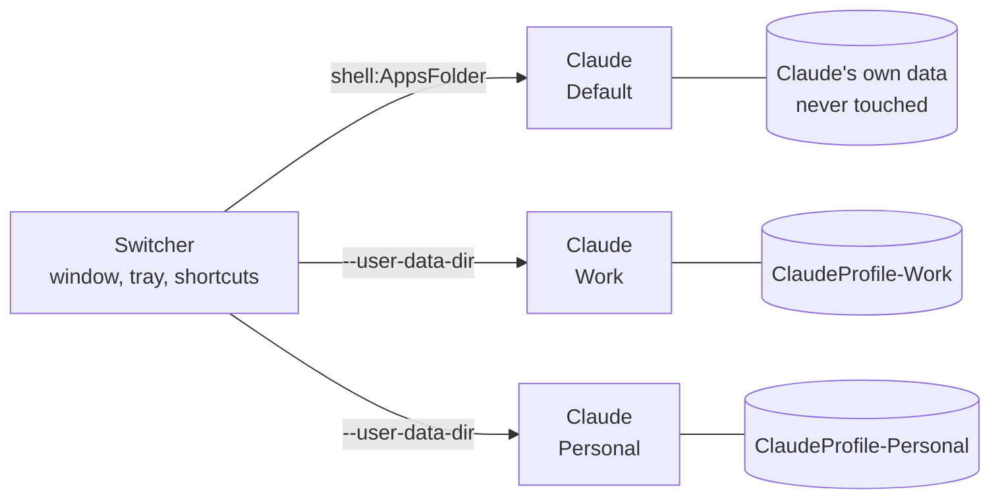

<div align="center">

# Claude Profile Switcher

**Run several Claude desktop accounts on one Windows PC, side by side, without ever signing out.**

[](https://github.com/PriyanshuGeTRekT/Claude-Code-Desktop-Switcher/stargazers)
[](https://github.com/PriyanshuGeTRekT/Claude-Code-Desktop-Switcher/releases)
[](https://github.com/PriyanshuGeTRekT/Claude-Code-Desktop-Switcher)
[](https://github.com/PriyanshuGeTRekT/Claude-Code-Desktop-Switcher/actions/workflows/lint.yml)
[](LICENSE)
<br>


</div>

## Highlights

|  |  |
| --- | --- |
| **Add an account in one click** | **Add account** opens a fresh Claude window at the sign-in screen. Sign in and you're done. |
| **Concurrent accounts** | Every account runs in its own window. Open as many as you like at the same time. |
| **One click to switch** | Launch a profile, or bring it to the front if it is already open. Also from the tray. |
| **Move Claude Code chats** | Copy chats from one account to another and carry on where you left off. |
| **Icons you can tell apart** | Each profile gets a coloured badge for its desktop and Start menu shortcuts. |
| **Nothing to install** | One PowerShell script. No patching, no proxy, no credential juggling. |
| **Your original stays put** | The account you already have is never touched and keeps auto update and `claude://` links. |

## Quick start

**One line**, from the latest release:

```powershell
irm https://github.com/PriyanshuGeTRekT/Claude-Code-Desktop-Switcher/releases/latest/download/ClaudeSwitcher.ps1 -OutFile "$env:TEMP\ClaudeSwitcher.ps1"; powershell -ExecutionPolicy Bypass -File "$env:TEMP\ClaudeSwitcher.ps1" -Install
```

**Or from a clone:**

```powershell
git clone https://github.com/PriyanshuGeTRekT/Claude-Code-Desktop-Switcher.git
powershell -ExecutionPolicy Bypass -File .\Claude-Code-Desktop-Switcher\ClaudeSwitcher.ps1 -Install
```

`-Install` copies the switcher to `%LOCALAPPDATA%\ClaudeProfiles\.switcher`, adds
**Claude Profile Switcher** to the desktop and Start menu, adds **Claude - Add account** to the
Start menu, and opens the switcher. The downloaded copy is no longer needed afterwards, so
moving or deleting it breaks nothing.

> [!TIP]
> Downloaded a ZIP instead? Run `Get-ChildItem -Recurse | Unblock-File` in the folder first.

## Using it


1. Click **Add account**. A new Claude window opens at the sign-in screen.
2. Sign in with your other account. That's it: both accounts stay signed in from now on.
3. Optionally press <kbd>F2</kbd> to rename it from `Account 2` to something like `Work`.

You can also add an account without opening the switcher: search Start for
**Claude - Add account**, pick **Add account** from the tray icon, or run
`.\ClaudeSwitcher.ps1 -AddAccount`.

| Action | Button | Keyboard |
| --- | --- | --- |
| Open a profile, or switch to it if it is open | **Launch** / **Switch to**, or double-click | <kbd>Enter</kbd> |
| Add an account, opens straight to sign-in | **Add account** | <kbd>Ctrl</kbd>+<kbd>N</kbd> |
| Rename (only the label, sign-in is unaffected) | **Rename** | <kbd>F2</kbd> |
| Desktop and Start menu shortcuts | **Add shortcuts** | |
| Copy Claude Code chats to another account | **Transfer chats** | |
| Delete a profile and its shortcuts | **Delete** | <kbd>Del</kbd> |
| Open the profile folder | right-click, **Open folder** | |

Right-click any profile for the same actions.

### Tray

Closing the window keeps the switcher in the notification area. Right-click the tray icon to
jump to any account (open ones are ticked), add an account, or turn on **Start with Windows**. Untick
**Keep running in the tray** in the window if you would rather it quit on close.

### Shortcuts


**Add shortcuts** puts a `Claude - <name>` shortcut on the desktop and in the Start menu, so
you can search for an account or pin it and skip the switcher entirely. Each profile keeps its
colour, and clicking a shortcut for an account that is already open simply brings it forward.

### Moving Claude Code chats between accounts


Select a profile, click **Transfer chats**, tick the chats and pick where they go. The chat
stays in the original account as well. Both copies continue the same history, so finish in
one account before picking it up in the other.

> [!NOTE]
> The target account needs to have opened the Code tab once, so it has somewhere to put
> the chats. If it is running, quit and reopen it to see them. This feature is new; please
> [open an issue](https://github.com/PriyanshuGeTRekT/Claude-Code-Desktop-Switcher/issues)
> if a transferred chat does not show up or resume.

## Command line

| Command | Does |
| --- | --- |
| `.\ClaudeSwitcher.ps1` | Open the window |
| `.\ClaudeSwitcher.ps1 -AddAccount` | Add an account and open Claude at its sign-in screen |
| `.\ClaudeSwitcher.ps1 -Launch Work` | Open a profile, or bring it forward if it is open |
| `.\ClaudeSwitcher.ps1 -List` | Print profiles and which are running |
| `.\ClaudeSwitcher.ps1 -Shortcut Work` | Desktop and Start menu shortcuts for one profile |
| `.\ClaudeSwitcher.ps1 -Shortcut Work -To <dir>` | A shortcut in a folder of your choice |
| `.\ClaudeSwitcher.ps1 -Tray` | Start in the tray without the window |
| `.\ClaudeSwitcher.ps1 -Install` | Install (or refresh an install and its shortcuts), then open the switcher |
| `.\ClaudeSwitcher.ps1 -ClaudePath <exe>` | Point at `Claude.exe` if detection fails (remembered) |

`-Launch` and `-Shortcut` accept either a profile's name or its folder name.

## How it works

The Claude desktop app is built on Electron, and Electron honours `--user-data-dir`. A
profile is nothing more than a directory with its own cookie jar, Local Storage and
`config.json`, so each one is a fully independent login. Electron's single instance lock is
per directory too, which is why instances pointed at different directories run side by side
instead of focusing each other.



Claude ships in two shapes on Windows, and the switcher detects whichever you have:

| Build | Executable | Default profile data |
| --- | --- | --- |
| Store / MSIX | inside the package's `WindowsApps` folder | `%LOCALAPPDATA%\Packages\Claude_<id>\LocalCache\Roaming\Claude` |
| Installer | for example `%LOCALAPPDATA%\AnthropicClaude` | `%APPDATA%\Claude` |

<details>
<summary><b>Details that matter</b></summary>

- **`Default` is never touched.** On the Store build it is started through the shell app model
  rather than by running the `.exe`, so it keeps full package identity: `claude://` links, the
  native messaging host and auto update behave exactly as before. Profiles this tool creates
  live in `%LOCALAPPDATA%\ClaudeProfile-<name>`, nowhere near Claude's own data.
- **Profile folders sit directly under `%LOCALAPPDATA%`** because Cowork needs it. When a
  Cowork task runs locally, its Windows service is told only the profile folder's name and
  looks for the Linux VM image in `%LOCALAPPDATA%\<name>`, refusing junctions, so in a nested
  folder the VM never starts. Earlier versions kept profiles in
  `%LOCALAPPDATA%\ClaudeProfiles\<name>`; each one moves to its new place the next time the
  switcher starts. A profile that is open at that moment stays where it is, is still used
  from there, and moves on a later start.
- **Install paths contain the version number**, so they change with every update. Shortcuts
  resolve the executable when clicked and carry their own icon files, so they keep working
  and keep their icons after Claude updates itself.
- **Running detection** only counts the desktop app's own process. The Claude Code CLI is also
  called `claude.exe` and the desktop app starts one per Code session; those are ignored.
- **Renaming** changes a label only. The folder name is a profile's permanent id, because
  Electron stores absolute paths inside its data.
- **Chat transfer** copies the small per-chat file the desktop app keeps under
  `claude-code-sessions\<account>\<organisation>` into the other profile, re-pointed at that
  profile's account. The transcript itself is kept by Claude Code outside the profile.

</details>

## What has been verified

Tested on Windows 11 against the **Store (MSIX) build**, Claude `2.16120.0.0`: `-Install`
and its shortcuts, **Add account** opening a real Claude window at the sign-in screen,
switching to (and restoring) an open account, running detection alongside Claude Code
sessions, shortcut icons, every tray menu item, and <kbd>Ctrl</kbd>+<kbd>N</kbd>. Rename,
delete, single instance behaviour and chat transfer (on sample data) were exercised end to
end against a stand-in `Claude.exe`.

**Not yet verified:** the **installer build** (no such install was available) and **chat
transfer between two real signed-in accounts**. If you can try either, `-List` is a harmless
way to check detection, and there is an
[issue template](.github/ISSUE_TEMPLATE/installer_build_report.yml) for reporting back. That
is the most useful contribution anyone can make right now.

## Troubleshooting

<details>
<summary><b>"Could not find the Claude desktop app"</b></summary>

Pass `-ClaudePath` once, pointing at your `Claude.exe`. The choice is saved.
</details>

<details>
<summary><b>The script will not run</b></summary>

Use `-ExecutionPolicy Bypass` as shown above, and `Unblock-File` if you downloaded a ZIP. The
generated shortcuts already handle this.
</details>

<details>
<summary><b>A shortcut does nothing</b></summary>

Anything fatal is shown in a message box and written to
`%LOCALAPPDATA%\ClaudeProfiles\switcher-error.log`. If you deleted or renamed a profile
outside the switcher, its old shortcut will report that the profile no longer exists.
</details>

<details>
<summary><b>Known limitations</b></summary>

- Every instance shares Claude's taskbar identity, so open accounts group under one taskbar
  button with the same icon. Hover to see each window.
- A pinned profile shortcut shows up as a separate taskbar button from the window it opens.
- `claude://` links always open in the `Default` account.
- Only one account at a time can run Cowork tasks locally. Claude desktop gives every
  account of the same Windows user the same Linux VM, so a second account's VM fails to
  start while another's is running; quit the other one from its tray icon first. Tasks run
  in the cloud are not affected. Tracked in
  [anthropics/claude-code#98613](https://github.com/anthropics/claude-code/issues/98613).
- Each running account is a full copy of the app, so budget roughly one Claude's worth of
  memory per account. A profile grows to a few hundred MB, mostly caches.
- This is about the desktop app only. The `claude` CLI uses its own `CLAUDE_CONFIG_DIR`
  environment variable for the same purpose.
</details>

## Star history

<a href="https://star-history.com/#PriyanshuGeTRekT/Claude-Code-Desktop-Switcher&Date">
  <picture>
    <source media="(prefers-color-scheme: dark)" srcset="https://api.star-history.com/svg?repos=priyanshugetrekt/claude-code-desktop-switcher&type=Date&theme=dark">
    
  </picture>
</a>

## Contributing

Issues and pull requests are welcome. See [CONTRIBUTING.md](CONTRIBUTING.md) for setup, what to
test before opening a PR, and the Windows specific traps that have already caused bugs here.
Please also read the [Code of Conduct](CODE_OF_CONDUCT.md).

## Disclaimer

Unofficial, and not affiliated with, endorsed by, or supported by Anthropic. It uses only
documented Electron command line switches and does not modify the Claude application. Using
multiple accounts is subject to Anthropic's terms of service.

## License

MIT, see [LICENSE](LICENSE).
